# PolyBodyGrav — 规则体重力正演系统

**Gravity forward modeling for regular-shaped bodies.** Compute and visualize gravity anomalies and full tensor gravity gradiometry (FTG, 7 components) for 7 body types — analytical formulas for cuboids and spheres, hybrid analytical-numerical solutions for the rest, with multi-body superposition and parameter sensitivity analysis.

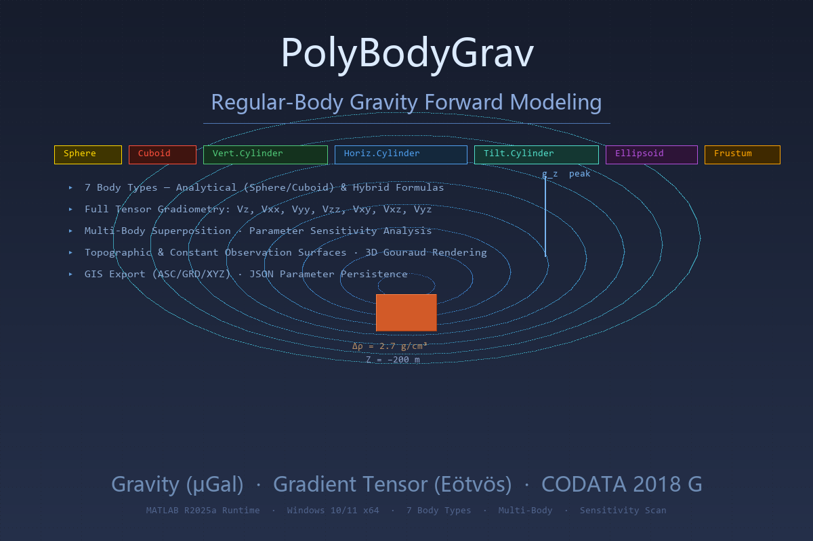

## Overview

PolyBodyGrav is a MATLAB desktop application for forward gravity modeling of regular geometric bodies. It covers the complete workflow from geometry setup, forward computation, multi-body combination, sensitivity scanning, to GIS-standard format export.

### Supported Body Types

| Body | Formula | Gravity | FTG (7 components) | 3D Color |
|------|---------|---------|---------------------|----------|
| **Sphere** | Point-mass analytical | ✓ | ✓ (analytical) | Gold |
| **Cuboid** | Nagy/Plouff (1976) prism | ✓ | ✓ (analytical) | Red |
| **Vertical Cylinder** | Axial + geometric attenuation | ✓ | ✓ (finite difference) | Green |
| **Horizontal Cylinder** | Finite line mass (Blakely 1996) | ✓ | ✓ (finite difference) | Blue |
| **Tilted Cylinder** | Blakely (1996) line integral | ✓ | ✓ (finite difference) | Cyan |
| **Ellipsoid** | Gauss-Legendre (32-node) + Z-Y-X Euler rotation | ✓ | ✓ (finite difference) | Purple |
| **Frustum** | Thin-disk trapezoidal integration | ✓ | ✓ (finite difference) | Orange |
| **Multi-body** | Linear superposition | ✓ | ✓ | Mixed |

### FTG Components

All 7 gravity gradient tensor components available in all body types:

$$V_z, \quad V_{xx}, V_{yy}, V_{zz}, \quad V_{xy}, V_{xz}, V_{yz}$$

- Cuboid & sphere: analytical FTG via Plouff formula (satisfies Laplace $V_{xx}+V_{yy}+V_{zz}=0$)
- Other bodies: Vz analytical + gradient via 3-layer finite difference with free-space Laplace constraint

### Units

| Quantity | Unit | Conversion |
|----------|------|------------|
| Gravity Vz | μGal | $1\ \mu\text{Gal} = 10^{-8}\ \text{m/s}^2$ |
| Gradient tensor | Eötvös (E) | $1\ \text{E} = 10^{-9}\ \text{s}^{-2}$ |
| Density | g/cm³ (UI) → kg/m³ (SI) | × 1000 |

## Features

### Forward Modeling
- 7 body types with analytical / hybrid-analytical formulas
- 7 FTG components per body type
- **Constant or topographic observation surface** (load external DEM as .asc/.grd/.dat/.txt/.xlsx)
- Gouraud-lit 3D visualization + plan-view contour map

### Parameter Sensitivity Analysis
- Select any scannable parameter as X-axis variable
- Define Min/Max range and step count
- Curve-family support with colon notation multipliers (e.g., `0.5:0.5:2.5`)
- Multi-curve output with 3D model preview

### Multi-Body Superposition
- Combine arbitrary numbers of bodies (sphere, cylinder, cuboid, ellipsoid, frustum)
- Per-body editable name, color, and parameters
- Linear superposition of gravity fields

### Persistence & Exchange
- **JSON parameter export/import**: Full parameter serialization across sessions
- **Auto-persistence**: Automatic save/restore of all inputs (`app_settings.mat`)
- **GIS-standard export**: ESRI ASCII Grid (.asc), Surfer 6 Grid (.grd), XYZ columnar (.dat)
- Columnar data export: TXT / XLSX formats

### Test Data (35 files, 7 terrain types × 5 formats)

| Terrain | Description | Grid |
|---------|-------------|------|
| `valley` | V-shaped valley | 201×201 @ 10m |
| `mountain` | Conical peak | 201×201 @ 10m |
| `slope_x` | X-direction slope | 201×201 @ 10m |
| `basin` | Basin depression | 201×201 @ 10m |
| `complex` | 2 peaks + 1 valley | 201×201 @ 10m |
| `flat` | Zero-elevation plane | 201×201 @ 10m |
| `random` | Random topography | 201×201 @ 10m |

Parameter presets: `preset_sphere.txt`, `preset_cuboid.txt`, `preset_vertical_cylinder.txt`, `preset_multibody.txt`

## Technical Principles

### Sphere — Point Mass (Analytical)

$$V_z = G \cdot M \cdot \frac{-dz}{r^3} \times 10^8 \quad (\mu\text{Gal})$$

$$V_{zz} = G M \frac{3dz^2 - r^2}{r^5} \times 10^9 \quad (\text{E})$$

### Cuboid — Nagy/Plouff Prism (Analytical)

8-corner sign-alternating kernel summation:

$$V_z = -G\rho_{si} \sum_{i=1}^{2}\sum_{j=1}^{2}\sum_{k=1}^{2} (-1)^{i+j+k} \cdot GH(\xi_i, \eta_j, \zeta_k)$$

$$G_{xx} = G\rho \sum \pm \arctan\frac{yz}{xR}, \quad G_{xy} = -G\rho \sum \pm \ln|z+R|$$

### Other Bodies — Hybrid (Analytical Vz + Finite-Difference Gradients)

1. Compute Vz analytically at 3 elevations: z₀, z₀±dz (dz=1.0m)
2. Vzz = (Vz_top − Vz_bottom) / (2·dz) × 10⁹
3. Vxz = ∂(Vz)/∂x, Vyz = ∂(Vz)/∂y (MATLAB `gradient`)
4. Free-space Laplace constraint: Vxx = Vyy = −Vzz/2, Vxy ≈ 0

### Gravitational Constant

CODATA 2018: $G = 6.67430 \times 10^{-11}\ \text{m}^3\cdot\text{kg}^{-1}\cdot\text{s}^{-2}$

## System Requirements

| Component | Requirement |
|-----------|-------------|
| OS | Windows 10/11 (64-bit) |
| Runtime | MATLAB Runtime R2025a |
| Memory | 8 GB recommended |

## Download

Get the latest installer from [Releases](https://github.com/ewencai/PolyBodyGrav/releases).

## Screenshots

### Sphere Forward Modeling
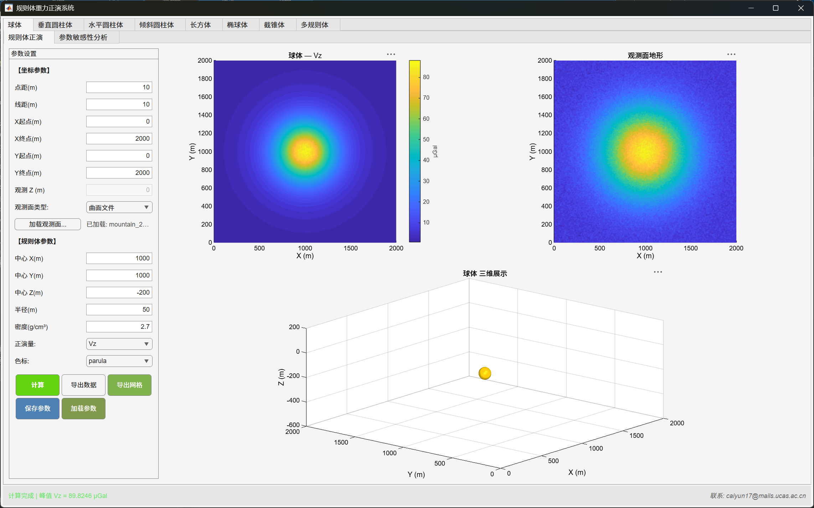

### Parameter Panel
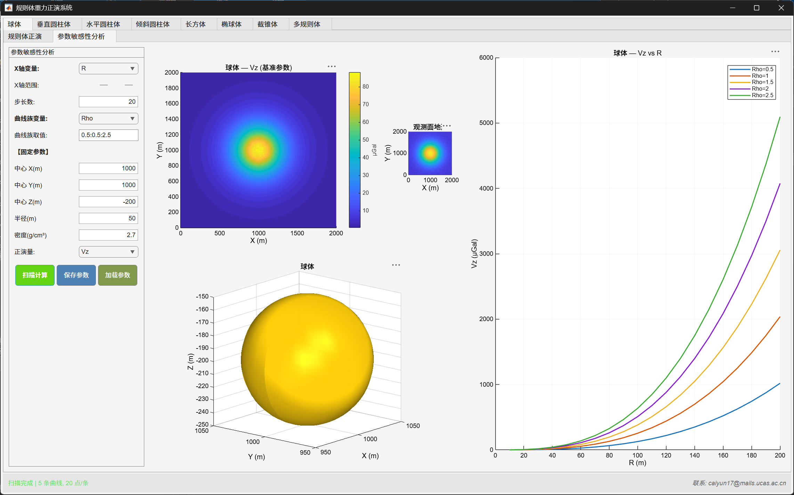

### 3D Visualization
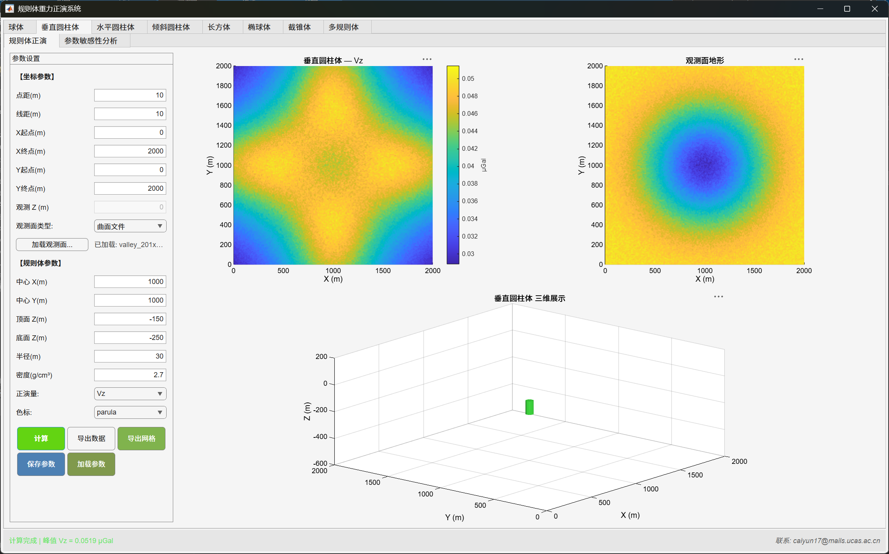

### Multi-Body Setup
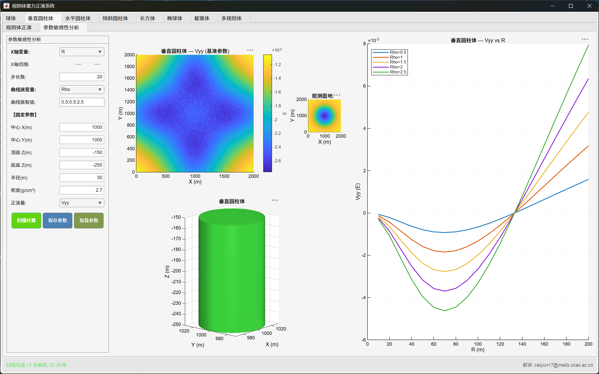

### Parameter Sensitivity Analysis
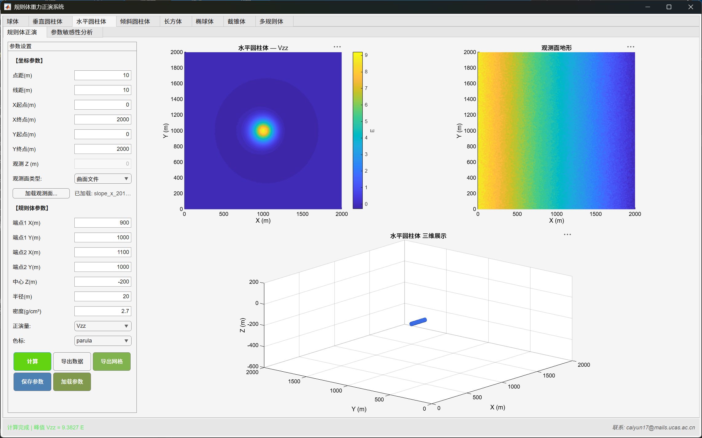

### Large Grid Result
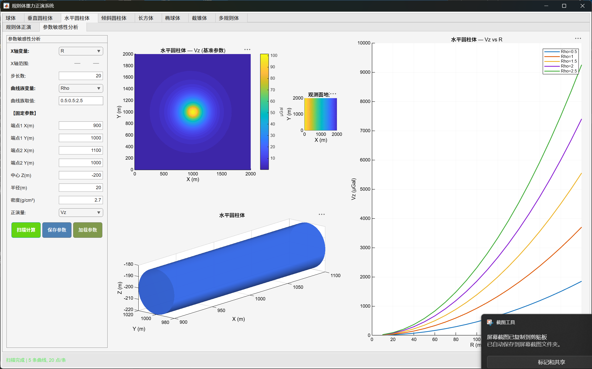

### Cuboid Forward Modeling
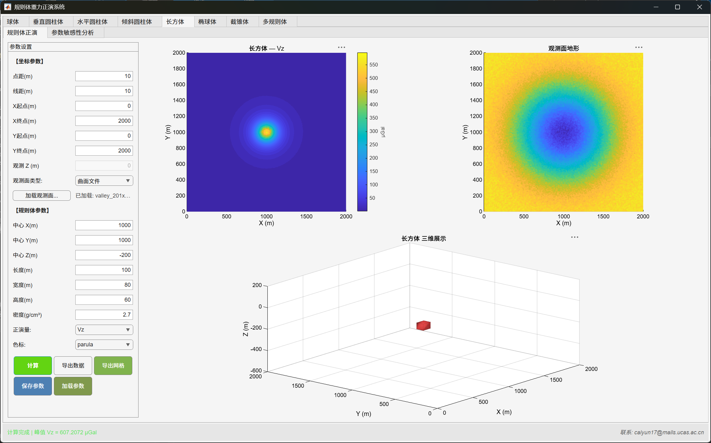

### Contour Map & 3D View
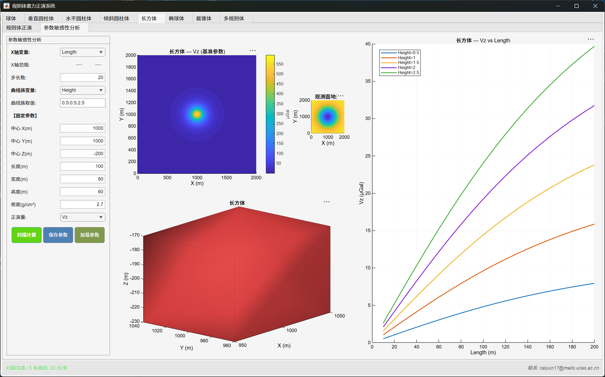

### Cylinder Forward Modeling
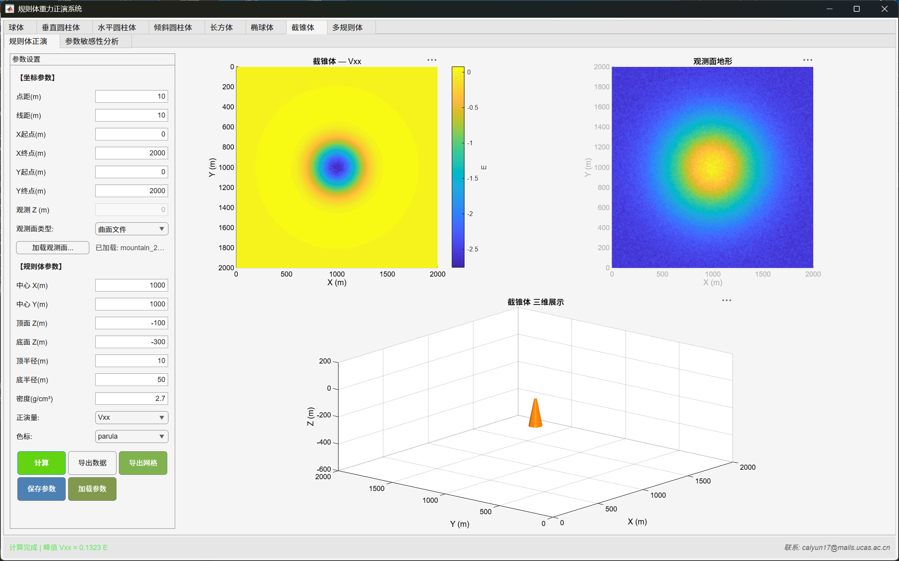

### Frustum Forward Modeling
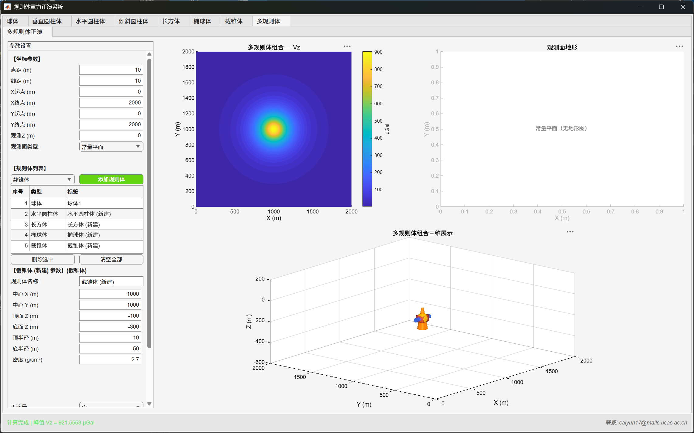

## Documentation

| Document | Content |
|----------|---------|
| [软件说明书 (Technical Manual)](docs/软件说明书.md) | Complete formulas for all 7 body types, finite-difference gradient theory, unit conversion, JSON parameter schema, file format specifications |

## ScreenShots

*Spherical body forward modeling with Gouraud-lit 3D visualization and plan-view contour*

*Parameter sensitivity analysis curve family*

## Z-Axis Convention

- **UI**: Z upward positive, downward negative (ground = 0, subsurface bodies Z < 0)
- **Computation kernel**: Auto-converted internally

## References

- Blakely, R. J. (1996). *Potential Theory in Gravity and Magnetic Applications*. Cambridge University Press.
- Nagy, D., Papp, G., & Benedek, J. (2000). The gravitational potential and its derivatives for the prism. *Journal of Geodesy*, 74, 552–560.
- Plouff, D. (1976). Gravity and magnetic fields of polygonal prisms. *Geophysics*, 41(4), 727–741.
- Werner, R. A. & Scheeres, D. J. (1997). Exterior gravitation of a polyhedron. *Celestial Mechanics and Dynamical Astronomy*, 65, 313–344.

---

*Forward modeling for exploration geophysicists — analytical where possible, numerical where necessary.*
